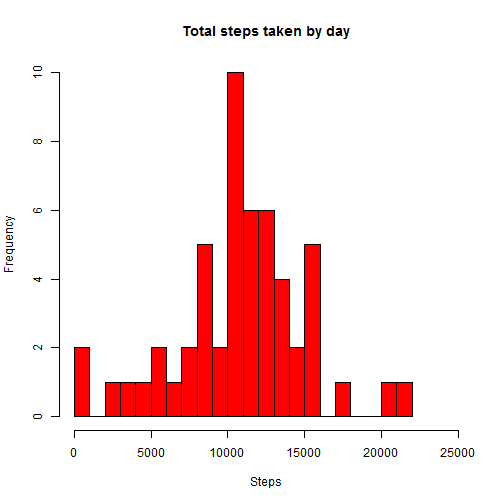
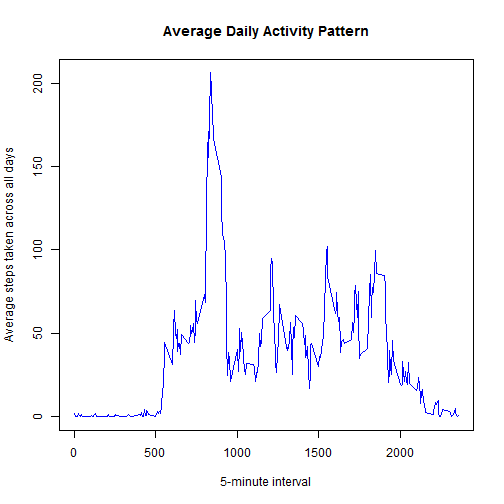
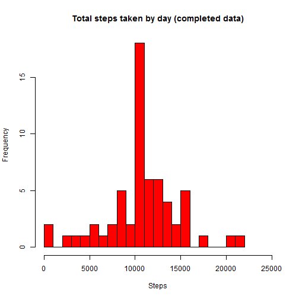

This assignment makes use of data from a personal activity monitoring device. This device collects data at 5 minute intervals throughout the day. The data consists of two months of data from an anonymous individual collected during the months of October and November, 2012 and include the number of steps taken in 5 minute intervals each day.


##Loading and preprocessing data
First step is loading and processing the data necessary for the analysis. We are assuming that the activity data file is in the working directory. This file will be unzipped and read into R via the read.csv function. Finally the date column will be converted into a date format using the as.Date function.


```r
activity <- read.csv("activity.csv", header = TRUE)
activity$date <- as.Date(activity$date, "%Y-%m-%d")
```

##What is the mean total number of steps taken per day?
For this part of the assignment we will ignore the missing values in the dataset. We will create a histogram of the total number of steps taken each day and then calculate the mean and median total number of steps taken per day.

In order to create the histogram, we will need to adjust the data. Using the aggregate function we will add up all of the steps per day. We will remove the NA values (although we ran the analysis without this and there are no changes). With the aggregated data we will create a histogram using the hist function.


```r
steps_by_day <- aggregate(steps ~ date, data = activity, sum, na.rm = TRUE)
hist(steps_by_day$steps, main = "Total steps taken by day", xlab = "Steps", col = "red", breaks=25, xlim=c(0,25000))
```

 

```r
steps_by_day_mean <- mean(steps_by_day$steps)
steps_by_day_median <- median(steps_by_day$steps)
```

The mean number of steps per day is 1.0766189 &times; 10<sup>4</sup> and the median number of steps per day is 10765.

##What is the average daily activity pattern?
For this section we will make a time series plot of 5-minute intervals and the average number of steps taken, averaged across all days. Then we will identify which 5-min interval on average has the highest number of steps.

Using the tapply function, we will calculate the average number of steps per interval across all the days in the dataset. With this data, we will use the plot function to plot out this data and then find the interval with the highest average number of steps.


```r
time_series <- tapply(activity$steps, activity$interval, mean, na.rm = TRUE)
plot(row.names(time_series), time_series,type = "l", xlab = "5-minute interval", ylab = "Average steps taken across all days", main = "Average Daily Activity Pattern", col= "blue")
```

 

```r
max_interval <- names(which.max(time_series))
max_interval<- as.integer(max_interval)
max_interval_5 <- max_interval+5
```

The 5-minute interval with the highest average number of steps is 835 to 840. 

##Inputing missing values
There are a number of days/intervals that are missing values (NA). The presence of these missing values may introduce a bias into some of the calculations or summaries that we have performed. 

We will start by calculating the total number of missing values in the dataset.

```r
Total_NAs <- sum(is.na(activity))
```

There are 2304 missing values in the dataset.

To find the impact of these missing values we are going to fill out these missing values with the mean (across all days) of the corresponding 5-min interval.

We will start by creating a new dataset as a copy of the original one and then calculate the average steps per interval from the original dataset which we will use to replace the missing values. 


```r
activity_filled <- activity
steps_by_interval <- aggregate(steps ~ interval, data = activity, mean)
```

Once we have the new dataset and the average values we will replace the missing values using a loop (for function) that will check all of the steps fields and when it finds a  missing one replace it with the average value for that corresponding interval. 


```r
for (i in 1:nrow(activity_filled)){
    if(is.na(activity_filled$steps[i])){
        activity_filled$steps[i] <- steps_by_interval[ which(steps_by_interval$interval == activity_filled$interval[i]),]$steps
     }
}
```

With the completed dataset, we can now proceed to repeat the calculations we performed earlier (average total number of steps per day, mean total steps per day and median steps per day). We will again create a histogram for the total number of steps taken by day and measure then mean/median.


```r
steps_by_day2 <- aggregate(steps ~ date, data = activity_filled, sum)

hist(steps_by_day2$steps, main = "Total steps taken by day (completed data)", xlab = "Steps", col = "red", breaks=25, xlim=c(0,25000))
```

 

```r
steps_by_day_mean2 <- mean(steps_by_day2$steps)
steps_by_day_median2 <- median(steps_by_day2$steps)
```

The mean number of steps per day for the completed dataset is 1.0766189 &times; 10<sup>4</sup> and the median is 1.0766189 &times; 10<sup>4</sup>. 

The original values were 1.0766189 &times; 10<sup>4</sup> mean and 10765

As you can see, the mean value is the same and the median value is very close. The reason why the mean value is the same is because the missing values are concentrated in certain days and not spread across all the days. There are a total of 2304 missing values but they are all in 8 days (8days * 24hrs/day * 12 intervals/hour). Since there are no values in these 8 days, the mean/median numbers are not affected by them. When we replace the missing values for the mean values for each interval, it is normal that the mean value for the whole set doesn't change since all we are doing is adding 8 more days with the same mean value. If the missing values had been in days we already had data for, the total number of steps would have changed and the mean/median value would have been impacted further.

##Are there differences in activity patterns between weekdays and weekends?
For this section we will look at differences in activity on weekdays versus weekends. We will use the completed dataset and we will add a new variable (weekday) with two levels indicating whether the day is a weekday or a weekend. Once we have this new variable we will create a time series plot of the 5-min intervals and the average steps taken averaged across all the weekday days or weekend days.


```r
activity_filled$weekday <- NA
for (i in 1:nrow(activity_filled)){
    if(weekdays(activity_filled$date[i])=="Saturday" | weekdays(activity_filled$date[i])=="Sunday") {
        activity_filled$weekday[i] <- "Weekend"
    } else { 
        activity_filled$weekday[i] <- "Weekday"
        }
}
activity_filled$weekday <- factor(activity_filled$weekday)
```

Once we have the new variable added to the dataset, we can calculate the average number of total steps by interval and weekday.


```r
steps_by_interval2 <- aggregate(steps ~ interval + weekday, data = activity_filled, mean)
library(lattice)
xyplot(steps ~ interval | weekday, steps_by_interval2, type = "l", layout = c(1, 2), xlab = "Interval", ylab = "Number of steps")
```

 

As you can see in the charts above, there are a number of differences in the steps activity on weekdays vs weekends. Activity tends to start earlier on weekdays and end later on weekends. This can be explained by the fact that people tend to sleep later on weekends and stay awake later on weekends. There also seems to be more activity in the middle of the day on weekends. A possible explanation for this is that many people are sitting down while at work whereas on weekends they are out doing things. 

